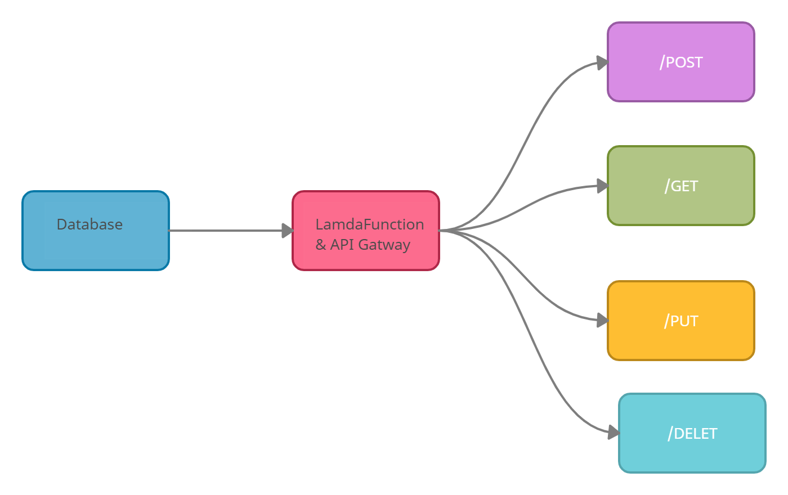

# Lab 18: AWS API, Dynamo and Lambda

### Create a serverless REST API.

Author: Sokiyna Naser

#### Link to GitHub repo
https://github.com/Sokiyna/serverless-api

#### Link to PR

https://github.com/Sokiyna/serverless-api/pull/1

## Feature Tasks
Create a single resource REST API using a domain model of your choosing, constructed using AWS Cloud Services.

### Routes: API Gateway
### POST: /people
### GET: /people and /people/{id}
### PUT: /people/{id}
### DELETE: /people/{id}
### Root URL: https://siqm8cpce7.execute-api.us-east-1.amazonaws.com/
### Routes: GET/POST to /people, GET/PUT/DELETE to /people/{id}

## Inputs:

### POST: input JSON body
### PUT: input JSON body
### DELETE: input ID

## Outputs:

### GET: returns objects from database (all or specific id)
### POST: returns object just added
### PUT: returns updated object
### DELETE: returns empty object

# UML

